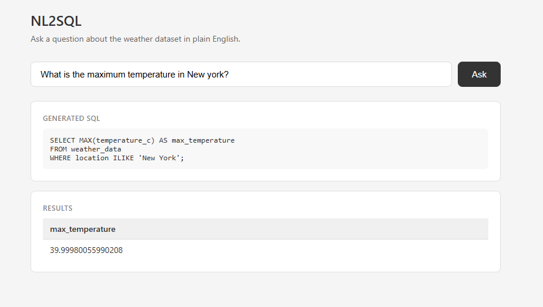

# NL2SQL - Natural Language to SQL Pipeline

A personal project built to explore how large language models can be used to query a relational database using plain English. The goal was to understand the full pipeline — from database setup to LLM integration — rather than just calling an API.

---

## Demo



The web interface takes a plain English question, generates the corresponding SQL, executes it against the database, and displays the results in a table.

---

## What it does

The system takes a natural language question, builds a structured prompt using the database schema, sends it to an LLM, and returns executable SQL. That SQL is then run against a PostgreSQL database to retrieve the actual results.

Example:

```
Input:  "What is the maximum temperature in New York?"
Output: SELECT MAX(temperature_c) AS max_temperature FROM weather_data WHERE location ILIKE 'New York';
Result: 39.99980055990208
```

---

## Project Structure

```
NL2SQL/
├── app.py                # Flask web server
├── main.py               # SQL generation pipeline (prompt builder + LLM call)
├── extract_schema.py     # Connects to PostgreSQL and extracts schema metadata
├── schema.json           # Generated schema with column types and descriptions
├── weather_data.csv      # Source dataset used to populate the database
├── templates/
│   └── index.html        # Web interface
└── README.md
```

---

## How it works

### 1. Schema Extraction
`extract_schema.py` connects to PostgreSQL and queries `information_schema.columns` to pull all table and column metadata. This is saved to `schema.json` with column types and manually written descriptions.

### 2. Prompt Building
`main.py` loads `schema.json` and formats it into a readable string. This is combined with the user's question into a structured prompt that tells the LLM exactly what the database looks like.

### 3. SQL Generation
The prompt is sent to an LLM (currently Google Gemini via the `google-genai` SDK). The model returns only a SQL query with no extra explanation.

### 4. Execution
The returned SQL is run against the PostgreSQL database using `psycopg2` and the results are displayed in the web interface.

---

## Dataset

The dataset is a simulated weather dataset with the following columns:

| Column | Type | Description |
|---|---|---|
| location | text | City name |
| date_time | timestamp | Date and time of observation |
| temperature_c | double precision | Temperature in Celsius |
| humidity_pct | double precision | Humidity percentage |
| precipitation_mm | double precision | Rainfall in millimeters |
| wind_speed_kmh | double precision | Wind speed in km/h |

---

## Setup

### Requirements

```bash
pip install psycopg2-binary pandas google-genai flask
```

### Database

Create the table in PostgreSQL:

```sql
CREATE TABLE weather_data (
    id SERIAL PRIMARY KEY,
    location TEXT NOT NULL,
    date_time TIMESTAMP NOT NULL,
    temperature_c DOUBLE PRECISION,
    humidity_pct DOUBLE PRECISION,
    precipitation_mm DOUBLE PRECISION,
    wind_speed_kmh DOUBLE PRECISION
);
```

### Environment Variable

Set your Gemini API key before running:

```bash
# Windows (PowerShell)
$env:GOOGLE_API_KEY="your-api-key-here"
```

### Run

```bash
python extract_schema.py   # generates schema.json (run once)
python app.py              # starts the web server
```

Then open **http://127.0.0.1:5000** in your browser.

---

## Limitations

- No SQL validation layer before execution
- Schema is generated manually and not refreshed automatically
- Single table only at this stage
- No query history or session tracking

---

## What I learned

- How to extract and represent database schema programmatically
- How schema context directly affects LLM SQL accuracy
- How to structure prompts for structured output (SQL only, no explanation)
- End-to-end integration between PostgreSQL, Python, and an LLM API
- How to wrap a Python pipeline in a Flask web server
